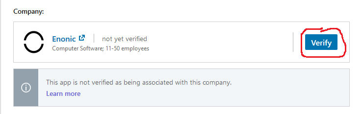
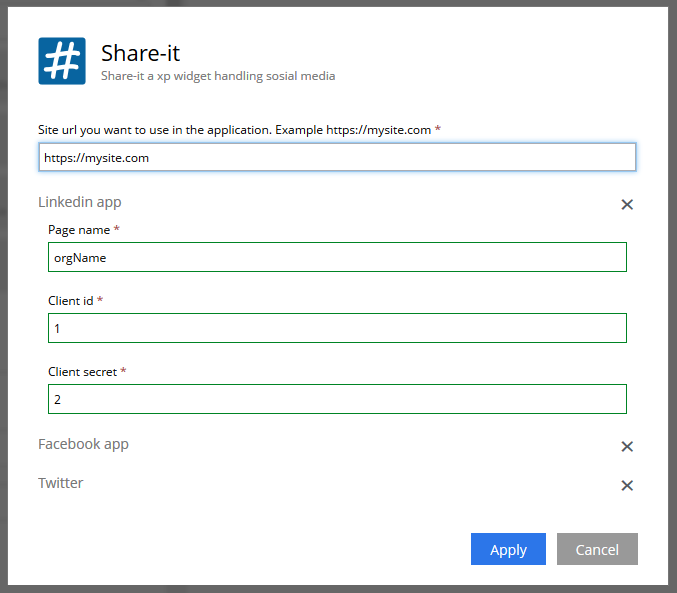

# How to setup Linkedin in the shareit app.

The account you login with needs to have admin rights to the company linkedin page.

1. Create an app, get it verified
2. Copy client keys
3. Authenticate the application

## Create an app
Go to the developer page on linkedin https://www.linkedin.com/developers +
Create an app, this is used to communicate with Linkedin and its API's

To access organization data fra linkedin you have to request for the marketing developer platform. +
Its located under the *products* tab on the linkedin application page. +
Apply to get the marketing developer platform +
This process takes a couple of days to get approved. 

You also need to verify your application: 
This is done on the settings tab on the linkedin application.

If you are an administrator the the company site you can open the generated url and verify it.

## Copy Client keys
On the auth tab of the linked application page are the application credentials.

The Client ID & Client Secret need to be copied over to share it application configuration.

Access the site, and its applications:

image:images/site-config.png[Site-config, 500]

The enter the client id and client secret.

The *Page name* is an important field. It is used to find the organization page.
Linkedin calls this vanity name, and you can find the vanity name by going to the page url.

Given this url: https://www.linkedin.com/company/devtestco1/ +
The vanity name is the last path in this url: "devtestco1" +
Find this value for the organization page, and add it to the *page name* field in the application settings.