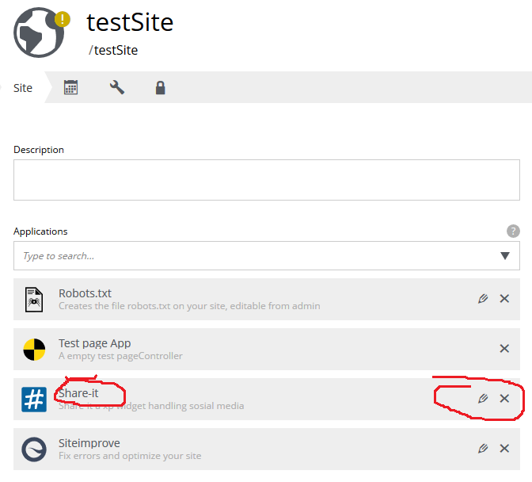
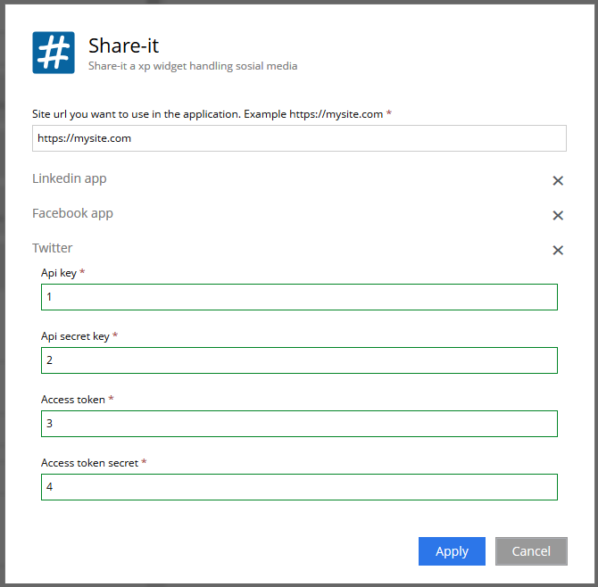

# How to setup Twitter in the shareit app.
The shareit app is created for organizations. Not individual accounts/users.

Here is the summary of setting up the Twitter: 

1. Apply for a developer account
2. Create an Twitter application
3. Use the generated key and token in the shareit application

## Apply for a developer account

Share it is made to make social media posts from organization pages. 
Use this organiation account when applying for the below setup. +
The first thing to do is go to the https://developer.twitter.com page. Apply for a Twitter developer account. 

## Create a Twitter application

Go to your Twitter app page https://developer.twitter.com/en/apps +
Create an twitter app, this creates the link to the Twitter api. +

Fill in all the required fields in the online form. 
The app needs to be configured for the organization. 

For the shareit application don't fill inn these fields: +

* *Allow this application to be used to sign in with Twitter* Signing in is not used.
* *Callback URLs* There are not in use. (No oauth is used)

Some field are special and need some attention:

The fields *terms of service*, *privacy policy url* i will leave it up to each organization to fill them in or not.
The app is made to only be used within an organization, so setting these fields is not important. 

*Tell us how this app will be used* +
This field is an important field. 
Give a short sumary about the use: +
Tell something about the app being used in Enonic XP, to enable editors to post messages from the organization account.

## Use generated key and token in Shareit
Go to the Twitter app page. An application should now show up on the page. +
Click the *details* button and *Key and tokens* tab.

Copy each of the twitter keys and tokens into the site config.

.Site with the installed applications list

.Application configuration for twitter

Also don't forget to add the site domain at the top.

All 4 fields in the twitter configuration are required.